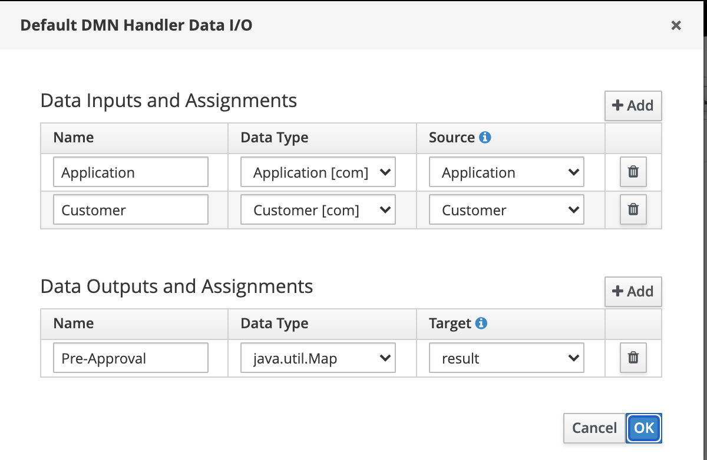
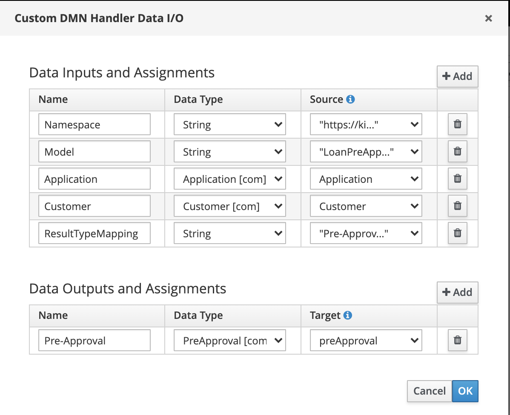
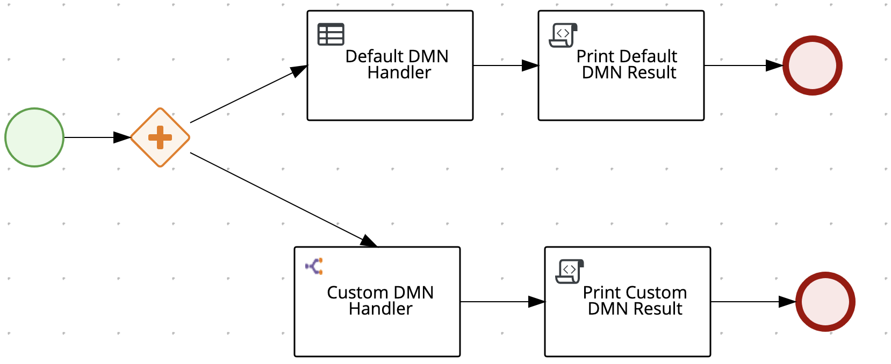

# Motivation

DMN Models are capable of producing results in a form of complex objects (i.e. Customer).
Further, if DMN is invoked from within the BPMN process in a form of Rule Task, every DMN Results which is mapped back to the calling process is returned
in a form of `LinkedHashMap`. To transform this `LinkedHashMap` into a custom object one would have post process it somehow - i.e. via Script Task or via another Work Item.

The default configuration of the output in Rule Task looks like this:


In our example, the output is `Pre-Approval`, which is a complex object with two attributes:

 - approved (Boolean)
 - reasons (List of strings)

 But with the default Rule Task we are are not able to get the result back in a form of `PreApproval` object, instead, we get it back as  in a form of `java.util.Map` with two keys `approved` and `reasons`

 The purpose of this spike is to prove out feasibility of automated marshalling of DMN Results from Map to Custom Object. So if customer needs to work with Custom Objects (instead of Maps) this should make the invocation of DMN models from BPMN process easier and get rid of the boiler plate code ensuring data transformation, thus increasing the overall process readability.

 # Technical overview of the solution

The core idea is to transform Map to Json and then Json to Custom Object.
Disadvantage is the apparent inefficiency of such solution, advantage is the simplicity and feasibility without any major disruptions to any of the existing APIs.

Further inspiration was found in the [RESTWorkItemHandler](https://github.com/kiegroup/jbpm/blob/master/jbpm-workitems/jbpm-workitems-rest/src/main/java/org/jbpm/process/workitem/rest/RESTWorkItemHandler.java).
However there is one big difference between DMN Rule Task Handler and the RESTWorkItemHandler. DMN Rule Task can produce multiple different outputs - this can be list of completely different data types, ranging from primtiives such as booleans to very nested complex structures. So one of the requirement is to allow user ability to pick and chose which DMN Results he wants to marshal to his desired custom Object and which he wants to keep intact.

The final solution involves custom work item handler `MyCustomDMNHandler` which introduces one extra Input Attribute `ResultTypeMapping`

The example usage of such attribute is `Pre-Approval=com.PreApproval;Customer=com.Customer` where `Pre-Approval` is name of the DMN Result and `com.PreApproval` is the FQCN of the target custom class.

This is how custom DMN Task configuration look like:


Notice the input variable `ResultTypeMapping`. Also notice the Data Type of the `Pre-Approval` output variable - we are now mapping the output to a custom object `PreApproval` as opposed to generic `Map` Object.

Under the hood, the `MyCustomDMNHandler` introduces a `classLoader` variable in a constructor and kie-server takes care of injecting the KJAR classloader when configured like this:

```xml
        <work-item-handler>
            <resolver>mvel</resolver>
            <identifier>new org.redhat.MyCustomDMNHandler(classLoader,"com.playground","DMNExperiment","1.0.0-SNAPSHOT")</identifier>
            <parameters/>
            <name>DecisionTask</name>
        </work-item-handler>
```

Custom handler code snippet:

```java
        results.keySet().forEach(k -> { //DMNResult

//if we are processing DMN Result which user configured to be marshalled
            if (resultTypeMappingPairs.containsKey(k)) {
                    logger.info("About to marshal {} to {}", k,resultTypeMappingPairs.get(k));
//Then transform the result from Map to CustomObject and replace the workItem results for that given DMN Result
                    transformResult(results, (String) k, resultTypeMappingPairs);

            }
        });
```

# Seeing it in practice
The DMN model used is based on following example:
https://role.rhu.redhat.com/rol-rhu/app/courses/ad364-7.9/pages/ch06s06

The BPMN process demonstrating this solution looks like this:


Once deployed, the process can be started via:
```bash
curl -u anton:password1! -X POST "http://localhost:8080/kie-server/services/rest/server/containers/DMNExperiment/processes/DMNExperiment.DMNProcess/instances" -H "accept: application/xml" -H "content-type: application/json" -d " { \"Application\": { \"term\":24, \"amount\": 25000 }, \"Customer\": {\"fullName\": \"John Doe\", \"incomeAnnual\": 40000, \"age\": 23}  }
```

The server side output looks like this:

```
15:30:27,619 INFO  [stdout] (default task-33) Printing default DMN Results:class java.util.LinkedHashMap
15:30:27,619 INFO  [stdout] (default task-33) map key:approved, map value:true
15:30:27,619 INFO  [stdout] (default task-33) map key:reasons, map value:[Age validated, Monthly payment validated]
15:30:27,628 INFO  [stdout] (default task-33) Custom DMN Result:class com.PreApproval
15:30:27,628 INFO  [stdout] (default task-33) isApproved:true
15:30:27,628 INFO  [stdout] (default task-33) reasons:[Age validated, Monthly payment validated]
```

From the output above it's clear that the Default Rule Task is mapping Map to the process variable, while the Custom Rule Task is mapping the output to the custom java class `com.PreApproval`

And that's it!